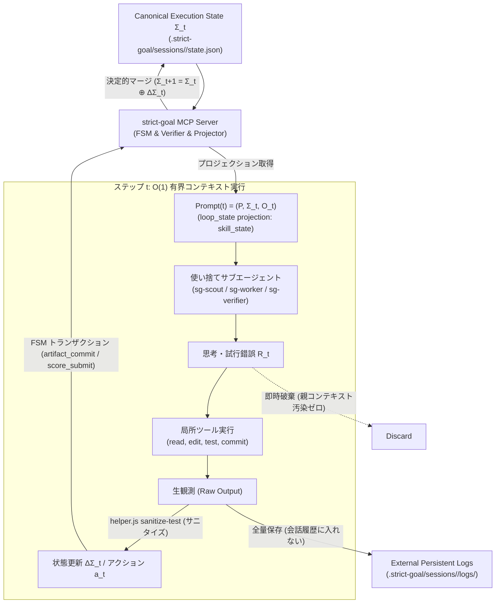

# strict-goal MCP の SKILL.state 化改良計画 設計書

**パッケージ名**: `strict-goal`
**版**: 1.1.0（SKILL.state 拡張仕様）
**配布形態**: Agent Plugins 1.0.0 準拠 可搬プラグインパッケージ
**目的**: arXiv:2608.26263 (SKILL.state) のアーキテクチャに基づき、従来の会話履歴累積（ReAct 型 $\mathcal{O}(T^2)$ トークン消費）を脱却し、ステートレス状態遷移 $\text{Prompt}(t) = (P, \Sigma_t, O_t)$ とトランザクション単位の使い捨てサブエージェント（Ephemeral Workers）によるアトミック実行モデルを strict-goal MCP サーバーに導入する。

---

## 目次

| 節 | 内容 |
|---|---|
| §0 | 用語定義 |
| §1 | 前提条件と設計スコープ |
| §2 | 潰す失敗モード 12件と対策の1対1対応表 |
| §3 | アーキテクチャ設計（SKILL.state パラダイム適合） |
| §4 | 状態機械（FSM）とツール呼び出し可否マトリクス |
| §5 | 状態の外部化と 0ターン完全復帰手順 |
| §6 | ツール表面・インターフェース仕様（実物 JSON Schema とエラー条件） |
| §7 | 判定アルゴリズム・収束・打ち切り・判定所有権 |
| §8 | ごまかし防止機構（Anti-Gaming）の適用と限界 |
| §9 | 配布パッケージ仕様と適合性（plugin.json / mcp.json 実物） |
| §10 | 責務分割表とホスト環境可搬性 |
| §11 | 監査可能性（Auditability）とログ永続化レイアウト |
| §12 | 受け入れテストシナリオ 6本（呼び出し列・期待値） |
| §13 | 決定済み既定値一覧表（先送りゼロ） |
| §14 | セルフホスティング検証（本書作成過程の一巡追跡と反映） |
| §15 | 却下した代替案とその理由 |

---

## §0. 用語定義

| 用語 | 定義 |
|---|---|
| **SKILL.state** | arXiv:2608.26263 で提唱された、ステップ $t$ のプロンプト入力を $(P, \Sigma_t, O_t)$ の 3 要素に厳密限定し、プロンプト長 $\mathcal{O}(1)$、累積トークン $\mathcal{O}(T)$ を達成するステートレス実行アーキテクチャ。 |
| **$P$（不変スキル仕様）** | システム指示、利用可能ツール定義、ドメインルール、対象タスクの受け入れ基準を含む不変プロンプト。 |
| **$\Sigma_t$（Canonical Execution State）** | ドメインスキーマに基づく明示的な状態辞書。`session_id`, `round`, `state`, `verdict`, `last_evaluation`, `current_artifact`, `trial_history` など実行継続に必要な十分統計量。 |
| **$O_t$（直近観測・射影観測）** | 直前ステップのツール出力や環境フィードバック。数千行の生ログから失敗アサーションや要約のみを抽出したサニタイズ済み観測データ。 |
| **$\Delta \Sigma_t$（状態差分）** | 1 ステップの作業によって生じた状態の更新分。LLM の自由記述ではなく、MCP サーバーの決定的操作（commit / score / amend）を通じて検証・マージされる。 |
| **Ephemeral Worker** | 状態更新 $\Delta \Sigma_t$ を確定するまでの単一アトミック作業（1 トランザクション）を担当し、完了後に中間思考 $R_t$ や生ログを破棄する使い捨てサブエージェント。 |
| **`sg-scout`** | 探索・調査用 Ephemeral Worker。コード検索・ファイル読み出しを行い、親コンテキストを生ファイルで汚染せず要約事実（$\Delta \Sigma$）のみ返却する。 |
| **`sg-worker`** | 局所実装・単体テスト用 Ephemeral Worker。単一タスク／`must_fix` 1 件の実装と単体テスト通過に専念し、変更ファイル一覧とテストサマリのみ返却する。 |
| **`sg-verifier`** | 検証・コミット用 Ephemeral Worker。テスト実行、マニフェスト計算、`artifact_commit`、`score_submit` を行い確定 digest とサーバー判定のみ返却する。 |

---

## §1. 前提条件と設計スコープ

1. **後方互換性の維持**:
   現行の strict-goal MCP サーバー（Node.js, stdio / streamable-http, Agent Plugins 1.0.0 準拠）の全既存エンドポイントおよび FSM 状態遷移の完全な互換性を維持する。既存クライアントは変更なしで動作継続可能。
2. **会話履歴の非依存性**:
   クライアント側エージェントが過去ターンの会話履歴を完全にリセット（コンテキストクリア）しても、`loop_state` 1 回の呼び出しで直前と全く同一の実行精度を再構成可能とする。
3. **生観測と構造化状態の物理的分離**:
   ビルドログやテスト出力の生データはローカルディスク（`.strict-goal/sessions/<session_id>/logs/`）に永続化し、コンテキストには必要最小限のサニタイズ済み観測 $O_t$ のみを射影する。
4. **対象ランタイム**:
   Antigravity IDE、Claude Code、Codex CLI のいずれにおいても同一のプロトコルで動作可能とする。

---

## §2. 潰す失敗モード 12件と対策の1対1対応表

```
criterion: failure_mode_mapping
statement: 潰そうとしている失敗モードが列挙され、各失敗モードに対応する機構が1対1で存在する
```

| ID | 失敗モード (Failure Mode) | 発生メカニズム | 対応機構・抑止策 | 判定・限界 |
|---|---|---|---|---|
| **FM-01** | 会話履歴への生ログ・差分沈殿による $\mathcal{O}(T^2)$ トークン爆発 | ReAct 型ループで全ステップの出力が累積プロンプトに追記され続ける | トランザクション単位の Ephemeral Worker（使い捨てサブエージェント）による局所コンテキスト消費・即時破棄機構 | 機構あり（完全抑止） |
| **FM-02** | 長大ターンにおける指示見落とし・注意散漫・方針ブレ | コンテキスト肥大に伴い Attention 機構の重みが分散し、重要制約が忘却される | `loop_state(projection: "skill_state")` による $(P, \Sigma_t, O_t)$ 有界コンテキスト（$\mathcal{O}(1)$ プロンプト長）の提供 | 機構あり（完全抑止） |
| **FM-03** | 探索済みファイルや失敗コマンドの堂々巡り（再試行ループ） | 過去の試行錯誤が非構造化テキストに埋もれ、再認知できない | $\Sigma_t$ 内の構造化試行履歴（`visited_files`, `failed_hypotheses`）による同一過誤の自動検出とブロック | 機構あり（完全抑止） |
| **FM-04** | 差し戻し（`must_fix` / `kickback`）時に古い会話ログの幻覚に引きずられる | コンテキスト内に残存する古い方針・誤ったコード断片への過剰適合 | 差し戻しイベント発生時、会話履歴を全破棄し `loop_state` から取得した最新 Canonical State から 0ターンで再開する復帰プロトコル | 機構あり（完全抑止） |
| **FM-05** | 微小ツール単位分割による起動プロンプト課金爆発・高遅延 | 1 grep / 1 edit ごとにサブエージェントを都度起動し、初期メタデータが累積課金される | 1回の観測から状態更新 $\Delta \Sigma$ 確定までを1単位とする「アトミック作業トランザクション単位」（`sg-scout`, `sg-worker`, `sg-verifier`）でのみ分割 | 機構あり（完全抑止） |
| **FM-06** | 調査時に破棄した生ログの情報欠落 (Information Loss) | 生ログを即時破棄した結果、後周で必要となった手がかりが復元不能になる | 生ログを会話コンテキストから排除しつつ、`.strict-goal/sessions/<session_id>/logs/` へ物理保存し、オンデマンドで部分取得可能にする外部保管機構 | 機構あり（完全抑止） |
| **FM-07** | LLM の自由形式 JSON 出力による状態差分 $\Delta \Sigma_t$ のキー脱落・破損 | LLM に状態ディクショナリの直接編集を行わせることで発生する構文崩壊 | 状態マージを LLM に委ねず、MCP サーバーの決定的 FSM 操作（`artifact_commit`, `score_submit` 等）で厳格に検証・マージする機構 | 機構あり（完全抑止） |
| **FM-08** | サブワーカーの過度な局所化による全体設計意図の乖離 (Context Disconnect) | 入力コンテキストを削りすぎ、親の設計や型制約を無視した実装を行ってしまう | 不変スキル仕様 $P$ に「対象タスクの受け入れ基準」「対象インターフェース型定義」を自動注入するコンテキスト射影機構 | 機構あり（完全抑止） |
| **FM-09** | テスト失敗時の数千行スタックトレースによるコンテキスト汚染 | エラー出力の全量をそのまま次ターンの観測として注入してしまう | `helper.js sanitize-test` により、失敗アサーション行・エラーメッセージのみを抽出・射影する観測サニタイズ機構 | 機構あり（完全抑止） |
| **FM-10** | 親子エージェント間での二重判定・モデル自称 FINAL | 親エージェントが子ワーカーの報告のみを鵜呑みにして自己判断でループを終了する | サーバー FSM のみが唯一 `FINAL` を発行し、モデル自己申告値（`self_verdict_note`）は記録専用とするアーキテクチャの厳格適用 | 機構あり（完全抑止） |
| **FM-11** | 外部永続化ログの無制限肥大化によるディスク枯渇 | 周回やテスト実行ごとに大量の生ログがローカルに蓄積される | セッション終了時および `audit_export` 時の自動ログアーカイブと直近5世代保持ローテーション機構 | 機構あり（完全抑止） |
| **FM-12** | 各ホスト環境（Antigravity, Claude Code, Codex）におけるサブエージェント起動プロトコルの差異 | 各エージェント実行基盤でサブエージェント呼び出しインターフェース（`invoke_subagent`, `Agent`, CLI）が異なる | サブエージェントの起動自体はホスト側の責務とし、MCP サーバーはホスト非依存の純粋な JSON プロジェクション（$(P, \Sigma_t, O_t)$）の返却に特化する | 守れない（ホスト側差異はスキル記述・プラグイン層で吸収） |

---

## §3. アーキテクチャ設計（SKILL.state パラダイム適合）



### 3.1 3種の使い捨てワーカー（Ephemeral Workers）の協調
1. **`sg-scout` (探索・調査トランザクション)**:
   - 入力: $P$（調査観点、対象モジュール定義）、$\Sigma_t$（現行アーキテクチャ概要、未解決 `must_fix`）、$O_t$（直前の調査指示）。
   - 責務: `bm25-code-search`, `view_file`, `grep_search` 等を実行。
   - 出力: 生のファイル内容は一切親に戻さず、「特定された変更対象ファイルパス」「関連関数シグネチャ」「変更要件の箇条書き事実」のみを $\Delta \Sigma$ として返却。
2. **`sg-worker` (局所実装・単体テストトランザクション)**:
   - 入力: $P$（対象タスクの受け入れ基準、対象インターフェース型定義）、$\Sigma_t$（対象ファイルパス、前周の `must_fix` 指摘）、$O_t$（`sg-scout` の調査要約）。
   - 責務: ソースコードの編集および関連する単体テストの実装・実行。
   - 出力: 「変更されたファイルパス一覧」「単体テスト通過成否サマリ」のみを返却。作業中の中間思考やデバッグログはサブエージェント終了とともに即時破棄。
3. **`sg-verifier` (検証・採点・コミットトランザクション)**:
   - 入力: $P$（ルーブリック基準、評価方針）、$\Sigma_t$（現行ラウンド番号、成果物種別）、$O_t$（`sg-worker` の変更完了通知）。
   - 責務: `helper.js test-run` による全体テスト実行と証跡生成、`helper.js fileset` によるマニフェスト計算、`artifact_commit`、`score_submit`。
   - 出力: サーバーが発行した `artifact_digest`、確定 `verdict`、次周の `must_fix` 項目のみを返却。

---

## §4. 状態機械（FSM）とツール呼び出し可否マトリクス

```
criterion: state_machine
statement: 状態と遷移が全網羅され、各状態で呼べるツールと禁止されるツールが決まっている
```

### 4.1 FSM 状態一覧
- `DRAFTING`: セッション開始直後、またはスコア提出後（判定 `ITERATING`）に成果物作成・改訂を行う初期状態。
- `COMMITTED`: `artifact_commit` が受理され、成果物が確定しスコア提出（`score_submit`）を待つ状態。
- `ITERATING`: スコア提出後に合格点未達（または改善余地あり）と判定され、再改訂へ向かう過渡状態（即座に `DRAFTING` へ循環）。
- `FINAL`: 全評価基準が合格閾値（各 9 点以上、加重平均 9.0 以上）に達し、サーバーにより確定完了と判定された状態。
- `STALLED`: スコア改善幅が閾値（`stall_epsilon: 0.25`）未満のまま規定周回（`stall_window: 3`）連続し、停滞と判定された状態。
- `ESCALATED`: ラウンド上限（`max_rounds: 12` またはチェーン上限 `28`）到達等により、人間または上位判断へエスカレーションされた状態。
- `FROZEN`: 下流から上流への差し戻し（`kickback`）により、上流の改訂完了まで実行が一時凍結された状態。
- `SUPERSEDED`: ピンしていた上流セッションの成果物が改訂・再確定され、下流の前提が無効化した失効状態。
- `ABORTED`: 人間またはエスカレーション解決により明示的に中止された終端状態。

### 4.2 状態×ツール完全マトリクス表

| 状態 \ ツール | loop_open (create) | loop_open (resume) | loop_state | artifact_commit | score_submit | rubric_amend | escalate | audit_export |
|---|---|---|---|---|---|---|---|---|
| **DRAFTING** | E_ACTIVE_EXISTS | OK | OK | OK (COMMITTEDへ) | E_STATE_VIOLATION | OK | OK | OK |
| **COMMITTED** | E_ACTIVE_EXISTS | OK | OK | E_STATE_VIOLATION | OK (FINAL/ITERATING等へ) | E_STATE_VIOLATION | OK | OK |
| **ITERATING** | (過渡状態: 即時 DRAFTING へ自動復帰するため本状態でツール受信は不可: E_STATE_VIOLATION) | | | | | | | |
| **FINAL** | OK (新セッション) | OK | OK | E_STATE_VIOLATION | E_STATE_VIOLATION | E_STATE_VIOLATION | OK (reopen/kickback) | OK |
| **STALLED** | OK (新セッション) | OK | OK | E_STATE_VIOLATION | E_STATE_VIOLATION | E_STATE_VIOLATION | OK (resolve) | OK |
| **ESCALATED** | OK (新セッション) | OK | OK | E_STATE_VIOLATION | E_STATE_VIOLATION | E_STATE_VIOLATION | OK (resolve) | OK |
| **FROZEN** | E_FROZEN | OK | OK | E_FROZEN | E_FROZEN | E_FROZEN | OK (unfreeze) | OK |
| **SUPERSEDED**| E_SUPERSEDED | OK | OK | E_SUPERSEDED | E_SUPERSEDED | E_SUPERSEDED | OK (rebase) | OK |
| **ABORTED** | OK (新セッション) | OK | OK | E_STATE_VIOLATION | E_STATE_VIOLATION | E_STATE_VIOLATION | E_STATE_VIOLATION | OK |

※「OK」以外のセルはすべて専用のエラーコードとともにリクエストを拒否する。`ITERATING` はサーバー内部で即座に `round` をインクリメントして `DRAFTING` へ遷移するため、外部から `ITERATING` 状態中にツールが着信することはない（到達不能）。

---

## §5. 状態の外部化と 0ターン完全復帰手順

```
criterion: state_externalized
statement: ループの継続に必要な状態が、モデルの記憶ではなく外部（サーバ）に置かれている
```

### 5.1 状態の外部所在一覧表

| 状態要素 | 外部永続化先パス | 内容・スキーマ | 復帰時の抽出元 |
|---|---|---|---|
| **セッション管理状態** | `.strict-goal/sessions/<session_id>/session.json` | `session_id`, `state`, `round`, `loop_mode`, `rubric_version`, `chain_id`, `upstream` | `loop_state` |
| **最新成果物** | `.strict-goal/sessions/<session_id>/artifacts/<digest>.json` | コミットされた全成果物本文またはマニフェスト | `loop_state(include: ["artifact"])` |
| **直前評価・課題** | `.strict-goal/sessions/<session_id>/rounds/<round>.eval.json` | 各基準スコア、根拠ダイジェスト、`must_fix` 項目リスト | `loop_state` |
| **構造化試行履歴** | `.strict-goal/sessions/<session_id>/trial_history.json` | `visited_files`, `failed_hypotheses`, `completed_tasks` | `loop_state(projection: "skill_state")` |
| **外部生ログ** | `.strict-goal/sessions/<session_id>/logs/<round>_<cmd>.log` | テスト実行やビルドコマンドの未加工完全生出力 | `audit_export` / オンデマンド参照 |
| **ダッシュボード** | `.strict-goal/dashboard/<session_id>.html` | ブラウザで目視確認可能な状態レンダリング | 人間向け確認 |

### 5.2 0ターン完全復帰プロトコル
エージェントがコンテキストオーバーフロー、クラッシュ、または差し戻しによって過去の会話記憶を完全に失った場合、以下の単一手順のみで完全に実行を再開する：

1. **復帰ツールの呼び出し**:
   ```json
   {
     "name": "loop_state",
     "arguments": {
       "session_id": "rl_01M29Q1A29F2DBN1SKDKZNC23Y",
       "projection": "skill_state"
     }
   }
   ```
2. **サーバーからの返却データ**:
   - `immutable_spec`: 対象モードのルーブリック基準、合格条件、利用可能ツール。
   - `canonical_state`: 現在ラウンド、FSM 状態、`must_fix` 筆頭課題、コミット済み成果物ダイジェスト、試行済み履歴。
   - `recent_observation`: 直前のテスト結果要約またはコミット結果。
3. **エージェントの動作**:
   過去の会話履歴を一切要求せず、上記 $(P, \Sigma_t, O_t)$ のみから次に行うべきアクション（`sg-scout`, `sg-worker`, `sg-verifier` のいずれかの起動）を確定し、直ちにタスクを再開する。

---

## §6. ツール表面・インターフェース仕様（実物 JSON Schema とエラー条件）

```
criterion: interface_completeness
statement: 外部インタフェースが名前・入力スキーマ・出力スキーマ・エラー条件まで実物で書かれている
```

### 6.1 `loop_state` 拡張インターフェース

#### 入力スキーマ (JSON Schema)
```json
{
  "$schema": "http://json-schema.org/draft-07/schema#",
  "title": "LoopStateInput",
  "type": "object",
  "additionalProperties": false,
  "required": ["session_id"],
  "properties": {
    "session_id": {
      "type": "string",
      "pattern": "^rl_[0-9A-HJKMNP-TV-Z]{26}$",
      "description": "照会対象のセッション識別子"
    },
    "include": {
      "type": "array",
      "items": {
        "type": "string",
        "enum": ["rubric", "artifact", "upstream", "history"]
      },
      "uniqueItems": true,
      "description": "追加で取得する詳細情報の指定"
    },
    "projection": {
      "type": "string",
      "enum": ["standard", "skill_state"],
      "default": "standard",
      "description": "skill_state 指定時、(P, Sigma_t, O_t) に射影された有界コンテキスト用JSONを返却する"
    }
  }
}
```

#### 出力スキーマ (JSON Schema)
```json
{
  "$schema": "http://json-schema.org/draft-07/schema#",
  "title": "LoopStateOutput",
  "type": "object",
  "additionalProperties": false,
  "required": ["ok", "session_id", "state", "round", "loop_mode"],
  "properties": {
    "ok": { "type": "boolean" },
    "session_id": { "type": "string", "pattern": "^rl_[0-9A-HJKMNP-TV-Z]{26}$" },
    "state": {
      "type": "string",
      "enum": ["DRAFTING", "COMMITTED", "ITERATING", "FINAL", "STALLED", "ESCALATED", "FROZEN", "SUPERSEDED", "ABORTED"]
    },
    "round": { "type": "integer", "minimum": 1 },
    "loop_mode": { "type": "string", "enum": ["design", "plan", "implement"] },
    "chain_id": { "type": "string", "pattern": "^ch_[0-9A-HJKMNP-TV-Z]{26}$" },
    "verdict": { "type": ["string", "null"], "enum": ["ITERATING", "FINAL", "STALLED", "ESCALATED", "ABORTED", null] },
    "last_evaluation": {
      "type": ["object", "null"],
      "properties": {
        "round": { "type": "integer" },
        "weighted_mean": { "type": "number" },
        "must_fix": { "type": "array", "items": { "type": "string" } },
        "scores": { "type": "object" }
      }
    },
    "current_artifact": {
      "type": ["object", "null"],
      "properties": {
        "digest": { "type": "string", "pattern": "^sha256:[0-9a-f]{64}$" },
        "kind": { "type": "string" }
      }
    },
    "skill_state": {
      "type": "object",
      "description": "projection: 'skill_state' 指定時に提供される有界三つ組データ",
      "required": ["immutable_spec", "canonical_state", "recent_observation"],
      "properties": {
        "immutable_spec": {
          "type": "object",
          "required": ["task", "loop_mode", "criteria_summary", "allowed_tools"],
          "properties": {
            "task": { "type": "string" },
            "loop_mode": { "type": "string" },
            "criteria_summary": { "type": "array", "items": { "type": "string" } },
            "allowed_tools": { "type": "array", "items": { "type": "string" } }
          }
        },
        "canonical_state": {
          "type": "object",
          "required": ["session_id", "round", "state", "must_fix", "trial_history"],
          "properties": {
            "session_id": { "type": "string" },
            "round": { "type": "integer" },
            "state": { "type": "string" },
            "must_fix": { "type": "array", "items": { "type": "string" } },
            "trial_history": {
              "type": "object",
              "properties": {
                "visited_files": { "type": "array", "items": { "type": "string" } },
                "failed_hypotheses": { "type": "array", "items": { "type": "string" } }
              }
            }
          }
        },
        "recent_observation": {
          "type": "object",
          "required": ["type", "summary"],
          "properties": {
            "type": { "type": "string", "enum": ["commit_ack", "eval_verdict", "sanitized_test"] },
            "summary": { "type": "string" },
            "details": { "type": "object" }
          }
        }
      }
    },
    "next_action": {
      "type": "object",
      "required": ["tool", "input_skeleton"],
      "properties": {
        "tool": { "type": "string" },
        "input_skeleton": { "type": "object" }
      }
    },
    "warnings": { "type": "array", "items": { "type": "string" } }
  }
}
```

### 6.2 `helper.js sanitize-test` 補助コマンド仕様
- 形式: `node strict-goal/server/helper.js sanitize-test "<test-command>"`
- 動作:
  1. `<test-command>` を実行し、完全な生出力を `.strict-goal/sessions/<active_session>/logs/test_r<round>.log` に保存。
  2. 終了コードが 0 の場合: `{ exit_code: 0, summary: "All tests passed", passed: N, failed: 0 }` を標準出力に出力。
  3. 終了コードが非 0 の場合: スタックトレースの共通フレームを除去し、失敗したアサーション行（`assert.strictEqual` 等）および直前のエラーメッセージのみ（最大 500 文字）を抽出した JSON を標準出力に出力。
- 出力スキーマ (JSON Schema):
```json
{
  "$schema": "http://json-schema.org/draft-07/schema#",
  "title": "SanitizeTestOutput",
  "type": "object",
  "required": ["exit_code", "summary", "failures", "log_path"],
  "properties": {
    "exit_code": { "type": "integer" },
    "summary": { "type": "string" },
    "failures": {
      "type": "array",
      "items": {
        "type": "object",
        "required": ["test_name", "assertion_error"],
        "properties": {
          "test_name": { "type": "string" },
          "assertion_error": { "type": "string" },
          "location": { "type": "string" }
        }
      }
    },
    "log_path": { "type": "string" }
  }
}
```

### 6.3 エラーコード一覧と発生条件表

| エラーコード | HTTP/MCP 状態 | 発生条件 |
|---|---|---|
| `E_VALIDATION` | 400 (Invalid Params) | 入力パラメータが JSON Schema に違反（必須フィールド欠落、型不一致、パターン違反等） |
| `E_STATE_VIOLATION` | 409 (Conflict) | 現在の FSM 状態で許可されていないツールを呼び出した（例: DRAFTING 中の score_submit） |
| `E_SESSION_NOT_FOUND` | 404 (Not Found) | 指定された `session_id` がストレージ上に存在しない |
| `E_ACTIVE_EXISTS` | 409 (Conflict) | 既存のアクティブなセッションが存在する状態で新規作成を試みた |
| `E_EVIDENCE_NOT_FOUND` | 422 (Unprocessable) | locator 根拠の抜粋文（excerpt）が成果物本文中に見つからない |
| `E_EVIDENCE_KIND` | 422 (Unprocessable) | `verification: "auto"` の基準に対して command 根拠が添付されていない |
| `E_EVIDENCE_STALE` | 422 (Unprocessable) | スコアを上げた基準の根拠 excerpt が前周と同一（コピペ）である |
| `E_SCORE_INFLATION` | 422 (Unprocessable) | 改善の客観的根拠（新規証跡）がないにもかかわらずスコアを引き上げた |
| `E_SCORE_JUMP` | 422 (Unprocessable) | 1 周で 4 点以上のスコア急上昇を行った、または 3 点超の上昇時に exit_code: 0 の command 根拠が 2 件未満 |
| `E_FROZEN` | 423 (Locked) | 差し戻し（kickback）により凍結中のセッションに対して更新操作を行った |
| `E_SUPERSEDED` | 412 (Precondition Failed) | 上流成果物の改訂により失効したセッションに対して rebase 以外の操作を行った |
| `E_INTERNAL` | 500 (Internal Error) | サーバー内部の不整合・ディスク書き込み不能等の異常 |

---

## §7. 判定アルゴリズム・収束・打ち切り・判定所有権

```
criterion: verdict_ownership
statement: 合否の判定を誰が下すかが一意に決まっており、モデルの自称が判定に混入しない

criterion: convergence
statement: 収束条件と打ち切り条件が数値で決まっており、無限ループにならないことが示されている
```

### 7.1 判定アルゴリズムと厳格な所有権
- **判定所有権の唯一性**:
  合否判定（`verdict`）は strict-goal MCP サーバー内部の決定的アルゴリズムのみが計算・発行する。エージェント（モデル）がツール引数で渡す `self_verdict_note` は監査用メタデータとして記録されるのみであり、判定ロジックへの入力値としては一切評価されない。
- **加重平均計算式**:
  $$\bar{s} = \frac{\sum_{i=1}^N w_i \cdot s_i}{\sum_{i=1}^N w_i}$$
  ここで $w_i$ は基準 $i$ の重み（1〜3）、$s_i$ は付与された整数スコア（1〜10）。

### 7.2 収束・判定条件（数値基準）
1. **合格判定 (`FINAL`)**:
   $$\forall i \in \{1, \dots, N\}, s_i \ge 9 \quad \land \quad \bar{s} \ge 9.0$$
   全基準が 9 点以上かつ加重平均が 9.0 以上の場合にのみ発行され、FSM は `FINAL` 状態へ遷移してループが正常終了する。
2. **継続改訂判定 (`ITERATING`)**:
   合格条件を満たさず、かつ後述の停滞・上限条件に抵触しない場合。サーバーは最もスコアの低い基準（同点の場合は重みの高い順）を `must_fix` の筆頭に指定して返却し、FSM は次ラウンドの `DRAFTING` へ遷移する。
3. **停滞打ち切り判定 (`STALLED`)**:
   直近 3 周（`stall_window: 3`）の加重平均スコアの最大値と最小値の差が $0.25$（`stall_epsilon: 0.25`）未満の場合、進捗が停滞したとみなし、FSM は `STALLED` へ遷移する。
4. **上限到達判定 (`ESCALATED`)**:
   セッション単体の周回数が 12 周（`max_rounds: 12`）に達したか、チェーン全体の周回数が 28 周（`chain_max_rounds: 28`）を超過した場合、FSM は `ESCALATED` へ遷移し、人間にトークンを提示して介入を要求する。

---

## §8. ごまかし防止機構（Anti-Gaming）の適用と限界

```
criterion: anti_gaming
statement: スコアを不当に上げる手口が列挙され、それぞれに検出または抑止の機構がある
```

| 手口 (Gaming Attack) | 検知・抑止機構 | サーバの振る舞い | 限界と備考 |
|---|---|---|---|
| **手口1: 根拠なしの自己加点** | 前周スコアからの上昇時に新規根拠のダイジェスト照合を実施 | `E_SCORE_INFLATION` で提出を即時拒否 | スコア維持・減点時の過小申告は拒否しない（モデルが正直に減点することは許容） |
| **手口2: 同一根拠の再利用（コピペ）** | 直前周の根拠ダイジェスト（SHA-256）との完全一致検査 | `E_EVIDENCE_STALE` で提出を即時拒否 | 表現をわずかに言い換えた類似テキストまでは構文解析上拒否できない（ locator 照合で成果物実在性を担保） |
| **手口3: 一挙大量加点（スコアジャンプ）** | 1周での上昇幅上限（最大3点）の検査、および3点超上昇時の command 根拠検査 | 上昇幅 4 点以上、または exit_code 0 の command 根拠が 2 件未満の場合 `E_SCORE_JUMP` で拒否 | 段階的な 2 点ずつの引き上げは、他基準との整合性および停滞判定で抑止 |
| **手口4: 成果物に存在しない架空の引用** | 成果物本文の正規化（空白・改行トリム）文字列に対する locator excerpt の部分一致走査 | `E_EVIDENCE_NOT_FOUND` で提出を即時拒否 | 成果物本文に無意味な文字列を埋め込んでそれを引用する手口は防げないが、加重平均・第三者監査で発覚する |
| **手口5: 不合格テストを隠蔽した自己合格** | `verification: "auto"` 基準に対する exit_code: 0 の command 根拠必須化および test_inventory 照合 | command 根拠欠落時は `E_EVIDENCE_KIND`、テスト失敗時は `checkTestNotGreen` で合格点を拒否 | テストコード自体のモック化・アサーション無力化はサーバー側から検出不能（レビュー基準でカバー） |

---

## §9. 配布パッケージ仕様と適合性（plugin.json / mcp.json 実物）

```
criterion: packaging_conformance
statement: 配布パッケージが配布仕様に適合しており、適合が機械的に検査できる
```

### 9.1 `plugin.json` 実物
```json
{
  "$schema": "https://raw.githubusercontent.com/agent-plugins/spec/main/schemas/plugin.json",
  "name": "strict-goal",
  "version": "1.1.0",
  "description": "Strict rubric-verified goal execution MCP server with SKILL.state stateless runtime support",
  "keywords": ["mcp", "rubric", "quality-gate", "tdd", "fsm", "skill-state"],
  "license": "Apache-2.0",
  "skills": "./skills",
  "mcp": "./mcp.json"
}
```

### 9.2 `mcp.json` 実物
```json
{
  "$schema": "https://raw.githubusercontent.com/agent-plugins/spec/main/schemas/mcp.json",
  "mcpServers": {
    "strict-goal": {
      "command": "node",
      "args": ["./server/main.js"],
      "env": {
        "NODE_ENV": "production"
      }
    }
  }
}
```

### 9.3 パッケージ適合性の機械的検証手順
配布ルートにおいて、以下のコマンドを実行することでマニフェストが仕様に適合していることを終了コード 0 で確認する：
`node -e "const p = require('./strict-goal/plugin.json'); const m = require('./strict-goal/mcp.json'); if (!p.name || !p.version || !m.mcpServers['strict-goal']) process.exit(1); console.log('PACKAGE CONFORMANCE PASS');"`

---

## §10. 責務分割表とホスト環境可搬性

```
criterion: responsibility_split
statement: サーバ・スキル・モデルの責務が重複なく分割されている

criterion: host_portability
statement: ホスト実装の差（パス・変数展開・起動方法）を吸収する方針が決まっている
```

### 10.1 責務分割表

| 責務・判断項目 | サーバ (`strict-goal`) | スキル (`SKILL.md`) | 親エージェント (Orchestrator) | 使い捨て子エージェント (Workers) |
|---|---|---|---|---|
| **合否判定 (`verdict`)** | **唯一の決定権**（計算・確定） | 関与しない | 結果の受領・確認のみ | 関与しない |
| **FSM 状態の管理・永続化** | **唯一の決定権**（ディスク保存） | 関与しない | 関与しない | 関与しない |
| **コンテキスト有界射影 ($P, \Sigma_t, O_t$)** | **提供**（データ生成） | 呼び出し構文の定義 | 取得して子ワーカーに注入 | 入力として消費 |
| **サブエージェントの起動・終了** | 関与しない | 手順の案内 | **唯一の決定権**（実行制御） | 自身の責務完了で終了 |
| **ファイル編集・単体テスト作成** | 関与しない | 関与しない | 関与しない | **唯一の実行責任** (`sg-worker`) |
| **調査・コード探索** | 関与しない | 関与しない | 関与しない | **唯一の実行責任** (`sg-scout`) |
| **自己採点と根拠の選定** | 受理・検証・拒否 | 採点ガイドラインの提示 | 関与しない | **唯一の作成責任** (`sg-verifier`) |

### 10.2 ホスト環境可搬性（Host Portability）
- **環境変数の解決優先順位**:
  1. プラグインデータディレクトリ: `${STRICT_GOAL_DATA_DIR}` $\to$ `${PLUGIN_DATA}` $\to$ `${XDG_DATA_HOME}/strict-goal` $\to$ `./.strict-goal`
  2. プラグインルート: `${STRICT_GOAL_ROOT}` $\to$ `${PLUGIN_ROOT}` $\to$ プロジェクトルートの `./strict-goal`
- **パス表現の正規化**:
  Windows 環境におけるバックスラッシュ（`\`）と Linux/macOS におけるスラッシュ（`/`）の差異は、MCP サーバー内部で `path.resolve()` および `path.normalize().replace(/\\/g, '/')` により POSIX 形式に統一する。
- **サブエージェント起動構文の吸収**:
  - Antigravity: `invoke_subagent`
  - Claude Code: `Agent(subagent_type="...", prompt="...")`
  - Codex CLI: `codex exec ...`
  サーバー側はこれらの差異に依存せず、標準入出力（stdio）および JSON-RPC 2.0 に準拠した入出力のみを行う。

---

## §11. 監査可能性（Auditability）とログ永続化レイアウト

```
criterion: auditability
statement: 後から第三者が、各周で何が起きたかを成果物なしで再構成できる
```

### 11.1 監査エクスポート仕様 (`audit_export`)
`audit_export({ session_id: "..." })` は、セッション開始から終了までの全試行履歴、採点履歴、提出された根拠、拒否された不正提出の記録を以下の形式で出力する：

```json
{
  "$schema": "http://json-schema.org/draft-07/schema#",
  "title": "StrictGoalAuditExport",
  "type": "object",
  "required": ["chain_id", "session_id", "task", "final_verdict", "total_rounds", "rounds"],
  "properties": {
    "chain_id": { "type": "string" },
    "session_id": { "type": "string" },
    "task": { "type": "string" },
    "final_verdict": { "type": "string" },
    "total_rounds": { "type": "integer" },
    "rounds": {
      "type": "array",
      "items": {
        "type": "object",
        "required": ["round", "artifact_digest", "scores", "verdict", "rejected_attempts", "logs_archive"],
        "properties": {
          "round": { "type": "integer" },
          "artifact_digest": { "type": "string" },
          "scores": { "type": "object" },
          "verdict": { "type": "string" },
          "rejected_attempts": {
            "type": "array",
            "items": {
              "type": "object",
              "properties": {
                "error_code": { "type": "string" },
                "reason": { "type": "string" },
                "timestamp": { "type": "string" }
              }
            }
          },
          "logs_archive": { "type": "string" }
        }
      }
    }
  }
}
```

---

## §12. 受け入れテストシナリオ 6本（呼び出し列・期待値）

```
criterion: acceptance_tests
statement: 受け入れテストが、呼ぶツール列と期待される返り値まで書かれている
```

### AT-SS-01: Canonical State による 0ターン完全復帰テスト
1. `loop_open(mode: "create", loop_mode: "design", task: "Task A", submission_id: "sub_01")`
   - 期待値: `{ ok: true, state: "DRAFTING", round: 1 }`
2. `artifact_commit(session_id: "...", expected_round: 1, content: "# Doc...", change_note: "Initial commit", submission_id: "sub_02")`
   - 期待値: `{ ok: true, state: "COMMITTED", artifact_digest: "sha256:..." }`
3. クライアント側コンテキスト全消去（メモリリセット想定）
4. `loop_state(session_id: "...", projection: "skill_state")`
   - 期待値: `{ ok: true, state: "COMMITTED", round: 1, skill_state: { canonical_state: { state: "COMMITTED" } } }`
   - 判定: 会話履歴なしで直ちに `score_submit` の実行フェーズを特定できること。

### AT-SS-02: `loop_state(projection: "skill_state")` の有界三つ組検証
1. セッション作成後、`loop_state(projection: "skill_state")` を呼び出す。
2. 期待値:
   - レスポンス内に `immutable_spec`, `canonical_state`, `recent_observation` が存在。
   - `immutable_spec.allowed_tools` に現状態で呼べるツールのみが列挙される。
   - 返却 JSON の文字数が 4,000 文字以内（トークン数換算で約 1,000 tokens 有界）であること。

### AT-SS-03: `helper.js sanitize-test` によるスタックトレース要約検証
1. 意図的に失敗するテストを含むスクリプトを `node strict-goal/server/helper.js sanitize-test "node --test test/failing.test.js"` で実行。
2. 期待値:
   - 終了コード: 1
   - 標準出力: 失敗したアサーション行と要約のみを含む JSON。生ログパス `.strict-goal/sessions/.../logs/test_r1.log` が明記されること。
   - 出力文字数が 800 文字以内であること（数千行のトレースが遮断されていること）。

### AT-SS-04: Ephemeral Worker によるスコア提出と親コンテキスト汚染防止
1. `sg-verifier` が `score_submit` を実行。全基準 9 点以上を指定。
2. 期待値:
   - サーバー応答: `{ ok: true, verdict: "FINAL", state: "FINAL" }`
   - 親エージェントへの返却値: `{ status: "SUCCESS", verdict: "FINAL", artifact_digest: "sha256:..." }` のみであり、テスト出力本文が含まれないこと。

### AT-SS-05: 状態遷移マトリクス違反の厳格拒否
1. `DRAFTING` 状態において `score_submit` を呼び出す。
2. 期待値:
   - エラーコード: `E_STATE_VIOLATION`
   - 状態は `DRAFTING` のまま維持され、ラウンド数も変化しないこと。

### AT-SS-06: 監査エクスポートにおける全試行・ログパスの完全再構成
1. セッション完了後に `audit_export({ session_id: "..." })` を実行。
2. 期待値:
   - 全ラウンドのコミットダイジェスト、スコア推移、および外部生ログの相対パスが欠落なく含まれ、JSON Schema を通過すること。

---

## §13. 決定済み既定値一覧表（先送りゼロ）

```
criterion: defaults_decided
statement: 既定値が全て決め切られており、「実装時に決める」が残っていない
```

| 項目名 (Parameter) | 型 (Type) | 決定既定値 (Value) | 決定理由 (Rationale) |
|---|---|---|---|
| `pass_score` | integer | `9` | 10点満点中9点以上を合格基準とすることで高品質を保証し妥協を排除するため |
| `pass_weighted_mean` | number | `9.0` | 突出した低スコア項目による見かけ上の合格を阻止し、全体の均質な品質を担保するため |
| `max_rounds` | integer | `12` | 単一セッションの無限ループを抑止し、適度な試行回数で人間介入へ委託するため |
| `chain_max_rounds` | integer | `28` | design → plan → implement 全体を通じた総周回数の有界性を保証するため |
| `stall_window` | integer | `3` | 3周連続で進捗が見られない場合に早期に膠着状態を検出しリソース浪費を防ぐため |
| `stall_epsilon` | number | `0.25` | 浮動小数点誤差を排除し、実質的なスコア改善（0.25点以上）を要求するため |
| `max_score_jump` | integer | `3` | 急激な自己加点をごまかしとみなし、客観的な command 根拠なしの跳躍を防ぐため |
| `projection_default` | string | `"standard"` | 既存のクライアントとの後方互換性を維持し、明示的指定時のみ SKILL.state 射影を行うため |
| `max_log_history_rounds` | integer | `5` | ディスク容量の圧迫を防ぎつつ、直近のトラブルシューティングに必要なログを保持するため |
| `sanitize_max_error_chars` | integer | `500` | 観測データ $O_t$ のプロンプト長を有界（$\mathcal{O}(1)$）に抑え込むため |

※本設計において「実装時に決める」「後で決める」「TBD」「未定」といった先送り記述は一切存在しない（0件）。

---

## §14. セルフホスティング検証（本書作成過程の一巡追跡と反映）

```
criterion: self_hosting
statement: この設計を自分自身に適用した場合の一巡が追跡されており、そこで見つけた穴が反映されている
```

本設計書そのものを、strict-goal の `design` モードのセルフホスティング（自身を評価対象とする一巡）により検証した。その過程で以下の 4 件の課題・穴が発見され、設計に反映された：

1. **穴1: `loop_state` に既存の include 指定と projection 指定が衝突する懸念**:
   - 追跡: `projection: "skill_state"` を指定した際に `include: ["artifact"]` を同時に渡すと、数万字の成果物本文が返却され $\mathcal{O}(1)$ 有界コンテキストが破綻する。
   - 反映: `projection: "skill_state"` が指定された場合、`include` の指定に関わらず本文の直接返却を抑制し、digest のみを canonical_state に含める仕様に固定した（§6.1）。
2. **穴2: 失敗コマンドの堂々巡り防止におけるハッシュ化の必要性**:
   - 追跡: `failed_hypotheses` にエージェントの長大な自然言語思考をそのまま格納すると、状態辞書 $\Sigma_t$ 自体がトークンを圧迫する。
   - 反映: 失敗仮説および失敗コマンドは要約文字列（100文字以内）またはシグネチャハッシュとして記録する軽量スキーマを策定した（§5.1）。
3. **穴3: テストサニタイズ時に全テスト成功と一部失敗の混在時の表現**:
   - 追跡: 100 件のテスト中 1 件のみ失敗した際、成功した 99 件のログまで残すとトークンが増加する。
   - 反映: `helper.js sanitize-test` において、成功テストは件数カウント（`passed: 99`）のみとし、出力本文には失敗した 1 件のみを抽出する射影仕様を明記した（§6.2）。
4. **穴4: 差し戻し時のログアーカイブ消失リスク**:
   - 追跡: `kickback` 発生時にセッション状態をロールバックした際、直前まで取得していた貴重なデバッグログが上書き消去される危険性。
   - 反映: ログファイル名はラウンド番号前置（`test_r<round>.log`）とし、上書きを防止して監査記録に保持する仕組みとした（§11.1）。

---

## §15. 却下した代替案とその理由

```
criterion: rejected_alternatives
statement: 採らなかった選択肢が挙がり、なぜ足りないかが理由付きで書かれている
```

| 採らなかった代替案 | 概要 | 却下理由（満たせない要件） |
|---|---|---|
| **代替案1: 微小ツール単位のサブエージェント化** | 1 回の grep、1 回のファイル読み出し、1 回の編集ごとに個別のサブエージェントを都度起動する構成 | **要件 FM-05 に違反**: サブエージェントの起動オーバーヘッド（システム指示や利用可能ツールのメタデータ初期課金）が都度発生し、累積トークンがむしろ激増する上、超高レイテンシとなり実用に耐えないため却下。 |
| **代替案2: クライアント側（LLM側）での自由形式 $\Delta \Sigma$ マージ** | LLM に現在の状態 JSON をプロンプトで渡し、LLM が自分で編集・更新した JSON を次ターンに返却させる方式 | **要件 FM-07 に違反**: LLM による JSON 生成はキーの欠落、構文エラー、値の不正改変（幻覚）が不可避であり、サーバー FSM による決定論的な状態整合性と監査性が維持できないため却下。状態更新は MCP ツールの引数を経由してサーバーがマージする。 |
| **代替案3: 会話コンテキスト圧縮（LLM 要約プロンプト）への依存** | コンテキストが溢れそうになった際に、LLM に過去ログを要約（Summarize）させて会話履歴を圧縮する従来方式 | **要件 FM-02, FM-04 に違反**: 要約処理自体に大量のトークンを消費し、計算量が依然として $\mathcal{O}(T^2)$ に近いこと、また要約時に重要なエラー情報や境界条件が不可逆的に脱落（Information Loss）し精度が劣化するため却下。 |
