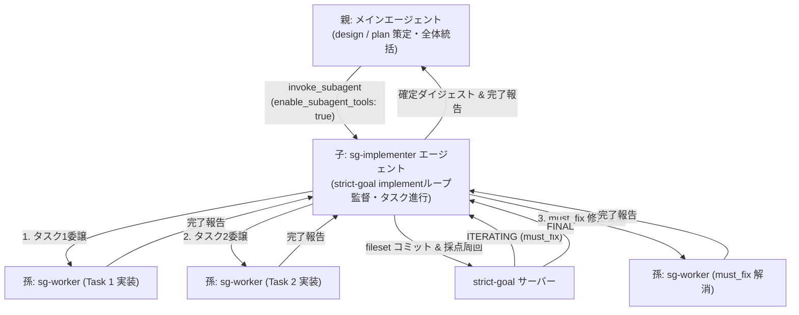

# 階層型サブエージェント（子監督・孫タスク実装）設計・計画

## 概要

`implement` サブエージェント（子）が `plan` のタスクリスト（Task DAG）を解析し、各タスクをシーケンシャルに孫エージェント（タスク実装ワーカー）へ委譲して実装させる階層構造を導入する。
子エージェントのコンテキスト肥大化を防ぎ、タスクごとの局所的・高精度な実装を実現する。

---

## アーキテクチャ (3層構造)

---

## 各層の責務

| 階層 | エージェント | ツール権限 | 主な責務 |
|---|---|---|---|
| **親** | メイン | 全権限 | ・ユーザー対話 ・`design` → `plan` の策定・採点完遂 ・子エージェント（`sg-implementer`）の起動と最終成果確認 |
| **子** | `sg-implementer` (実装監督) | subagents, bash, read, write, strict-goal MCP | ・`loop_open`（DRAFTING）の開設 ・上流 `plan` のタスク一覧を読み、1タスクずつ孫へ委譲 ・統合テスト確認・`helper.js` で fileset 生成 ・`artifact_commit` / `score_submit` の周回（FINALまで） |
| **孫** | `sg-worker` (実装作業員) | read, write, edit, grep, glob, bash | ・指定された1タスク（または `must_fix` 1件）の実装と単体テスト ・極小コンテキストで集中作業し、完了後に破棄 |

---

## 提案する変更内容

### 1. エージェント定義の新設・更新
- **[NEW] `.agents/agents/sg-worker.md`** & **`.claude/agents/sg-worker.md`**:
  単一タスクのコード編集・テスト通過に特化した孫エージェント定義。
- **[NEW] `.agents/agents/sg-implementer.md`** & **`.claude/agents/sg-implementer.md`**:
  孫エージェントを統括し `strict-goal implement` を完遂する子エージェント定義（`enable_subagent_tools: true`）。

### 2. スキル手順の更新
- **[MODIFY] `strict-goal/skills/strict-goal/SKILL.md`** & **`.agents/skills/strict-goal/SKILL.md`**:
  サブエージェント委譲セクションに「階層型タスク委譲プロトコル（子監督→孫実装）」の手順とプロンプト例を追記。

---

## 確認事項

- 孫エージェントの実行環境は、親（子エージェント）と同じ作業ツリー（`Workspace: inherit`）で直接ファイルを編集する方針で進めます。問題ないかご確認ください。
