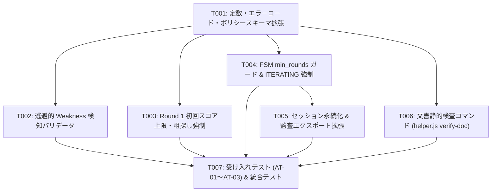

# Antigravity等におけるRound 1即時終了根絶・反復ループ強制 実装計画書 (Plan)

- **上流設計書**: [`docs/plans/design-anti-round1-final.md`](file:///d:/vagrant/harnesses/rubric-loop-mcp/docs/plans/design-anti-round1-final.md)
- **上流セッション**: `rl_01M2CA46TVTZ9NX5PCWXDJVH3M`（ダイジェスト: `sha256:cebb8f7ea094038bdd53f7297709c652c7f52ac269aeb89295552e54d40dfdf9`）
- **本計画セッション**: `rl_01M2CAR1DAMXKXJG7VZ4DKE1NQ`（チェーン: `ch_01M2CA46TQQSDEBX5YDF3XASSX`）
- **成果物 JSON**: [`docs/plans/plan-anti-round1-final.json`](file:///d:/vagrant/harnesses/rubric-loop-mcp/docs/plans/plan-anti-round1-final.json)

---

## 1. 計画概要・前提方針

Antigravity等のLLM実行環境においてRound 1で満点自己採点による即時FINAL終了が発生する問題を根本根絶するため、サーバ側での強制反復機構（`policy.min_rounds >= 2`、初回スコア上限 `first_round_ceiling`、逃避Weakness検知 `E_WEAKNESS_EVASIVE`、初回必須指摘 `E_FIRST_ROUND_UNCRITICAL`）をstrict-goalコアエンジンおよびhelper CLIに実装する。
上流設計書の失敗モードF-01〜F-08および受け入れテストAT-01〜AT-03を完全網羅し、各タスク中断時もGitアトミックリセットで安全性を担保する。

### 前提条件
1. strict-goal MCP サーバおよび helper CLI は Node.js >= 20 ESM 環境で動作する。
2. 既存のテストスイート（481件）に対する後方互換性を完全に維持する。
3. Antigravity 等の単一エージェント環境では `helper.js verify-doc` を通じた静的検査による機械的減点生成を併用する。
4. 各タスク中断時は `git checkout -- <files>` による単一タスク単位のクリーンリセットが可能である。

---

## 2. 失敗モード対応マッピング表 (Failure Mode Mapping)

| 失敗モードID | 内容 | 対応タスクID | 具体的な対策内容 |
|---|---|---|---|
| **F-01** | Round 1 全項目9点自己申告による即時 FINAL | **T004** | `decideVerdict` で `round < min_rounds` 時の `ITERATING` 強制 |
| **F-02** | Weakness 欄での「将来課題」「スコープ外」逃避 | **T002** | `EVASIVE_WEAKNESS_PATTERNS` による正規表現検知と `E_WEAKNESS_EVASIVE` |
| **F-03** | Antigravity でのサブエージェント呼出し不能 | **T006** | `helper.js verify-doc` による静的検査と機械的減点生成 |
| **F-04** | Round 1 での粗探し放棄 (All-Pass Bias) | **T003** | 初回 `min_first_round_must_fix` 検査と `E_FIRST_ROUND_UNCRITICAL` |
| **F-05** | 改善のないスコア微増によるループ抜け | **T003** | 初回スコア上限 `first_round_ceiling: 8` の適用 |
| **F-06** | 設計・計画モードでの無批判完了 | **T006** | 静的チェックリスト（文字数・見出し・未解決記号）自動検証 |
| **F-07** | プロセス異常終了・クラッシュ時のセッション不整合 | **T005** | `session.json` のアトミック更新と復元プロトコル |
| **F-08** | ディスク枯渇・ストレージ満杯時の書き込み失敗 | **T005** | `saveArtifactContent` 同期書き込み検査と縮退停止 |

---

## 3. タスク依存構造 (Task DAG)

---

## 4. タスク一覧と受け入れ基準

### T001: 定数・エラーコード・ポリシースキーマの拡張定義
- **目的**: 最低ラウンド数や初回スコア天井、逃避Weakness検知に必要な定数、エラーコード、スキーマプロパティを各定義ファイルに追加する。F-01〜F-08の共通基盤となる。
- **対応設計節**:
  - `## 1. 概要・背景・目的`
  - `## 3. インタフェース仕様 (Interface Completeness)`
  - `## 11. 配布パッケージ・適合性検査 (Packaging Conformance)`
  - `## 13. 既定値一覧 (Defaults Decided)`
- **依存タスク**: なし
- **変更対象ファイル**:
  - `strict-goal/server/src/config/defaults.js` (modify)
  - `strict-goal/server/src/errors/codes.js` (modify)
  - `strict-goal/server/src/rubric/schema.js` (modify)
  - `strict-goal/server/schemas/tools.json` (modify)
- **受け入れ条件**:
  - `defaults.js` に `MIN_ROUNDS_DEFAULT(2)`, `FIRST_ROUND_CEILING_DEFAULT(8)`, `MIN_FIRST_ROUND_MUST_FIX_DEFAULT(1)` がエクスポートされていること。
  - `codes.js` に新規3件のエラーコード（`E_MIN_ROUNDS_NOT_REACHED`, `E_FIRST_ROUND_UNCRITICAL`, `E_WEAKNESS_EVASIVE`）が正しくエクスポートされ、重複がないこと。
  - `rubric schema` のバリデーションにおいて `min_rounds`, `first_round_ceiling`, `min_first_round_must_fix` を含む `policy` が正常通過すること。
- **検証コマンド**: `node --test strict-goal/server/test/codes.test.js` (exit 0)
- **見積もり周回**: 1周

### T002: 逃避的 Weakness 検知バリデータの実装
- **目的**: 「将来の課題」「スコープ外」等の逃避的 Weakness を正規表現ブラックリストにより検出し `E_WEAKNESS_EVASIVE` で拒絶するバリデータを実装する。失敗モード F-02 を完全防止する。
- **対応設計節**:
  - `## 2. 失敗モード対応表 (Failure Mode Mapping)`
  - `### 3.1 新規・更新エラーコード`
  - `## 7. Anti-Gaming 機構`
  - `### 7.1 逃避的 Weakness パターンの検知ブラックリスト (E_WEAKNESS_EVASIVE)`
- **依存タスク**: `T001`
- **変更対象ファイル**:
  - `strict-goal/server/src/tools/score_submit.js` (modify)
- **受け入れ条件**:
  - `EVASIVE_WEAKNESS_PATTERNS` に一致する Weakness を含むスコア提出時に `E_WEAKNESS_EVASIVE` が返されること。
  - 正規の具体的欠陥指摘を含む Weakness ではエラーが発生せず正常に通過すること。
  - エラー `detail` に `criterion_id`, `matched_pattern`, `weakness_excerpt` が含まれること。
- **検証コマンド**: `node --test strict-goal/server/test/score_submit.test.js` (exit 0)
- **見積もり周回**: 1周

### T003: Round 1 初回スコア上限および粗探し強制バリデータの実装
- **目的**: Round 1 において初回スコア上限を超える点数（9点以上）の乱発や、合格基準を満たしながら must_fix が存在しない状態を検知し `E_FIRST_ROUND_UNCRITICAL` で拒絶する。失敗モード F-04, F-05 を防止する。
- **対応設計節**:
  - `## 2. 失敗モード対応表 (Failure Mode Mapping)`
  - `### 3.1 新規・更新エラーコード`
  - `### 7.2 初回スコア上限規律 (first_round_ceiling)`
- **依存タスク**: `T001`
- **変更対象ファイル**:
  - `strict-goal/server/src/tools/score_submit.js` (modify)
- **受け入れ条件**:
  - Round 1 で `pass_score` 未満の項目が `min_first_round_must_fix` 未満の場合に `E_FIRST_ROUND_UNCRITICAL` が返されること。
  - Round 2 以降ではこの制限が発火せず、通常の合否判定へ進むこと。
  - エラー `detail` に `round`, `failing_criteria_count`, `required_failing_count` が含まれること。
- **検証コマンド**: `node --test strict-goal/server/test/score_submit.test.js` (exit 0)
- **見積もり周回**: 1周

### T004: FSM 判定エンジンへの min_rounds ガードと強制 ITERATING 遷移の実装
- **目的**: `decideVerdict` において `session.round < policy.min_rounds` の場合は全基準が合格点であっても絶対に `FINAL` を発行せず `ITERATING` を強制する。失敗モード F-01 を根本解決する。
- **対応設計節**:
  - `## 2. 失敗モード対応表 (Failure Mode Mapping)`
  - `## 4. 状態機械 (State Machine)`
  - `### 4.2 FSM 判定遷移のアルゴリズム詳細`
  - `## 6. 合否判定の所有権 (Verdict Ownership)`
  - `## 8. 収束性 (Convergence)`
- **依存タスク**: `T001`
- **変更対象ファイル**:
  - `strict-goal/server/src/fsm/engine.js` (modify)
- **受け入れ条件**:
  - `session.round < policy.min_rounds` かつスコア合格条件を満たす場合、`verdict: 'ITERATING'`, `verdict_reason: 'min_rounds_not_reached'` が返されること。
  - `session.round >= policy.min_rounds` に達した時点で初めて合格判定時に `FINAL` が発行されること。
  - 返却オブジェクトに `enforced_iteration: true` が設定されること。
- **検証コマンド**: `node --test strict-goal/server/test/engine.test.js` (exit 0)
- **見積もり周回**: 1周

### T005: セッション永続化および監査エクスポートへの拡張情報記録
- **目的**: セッションファイルおよび監査エクスポートに `min_rounds` 関連のカウンタや強制イテレーション履歴を永続化・出力する。失敗モード F-07, F-08 に対応する。
- **対応設計節**:
  - `## 2. 失敗モード対応表 (Failure Mode Mapping)`
  - `## 5. 状態外部化 (State Externalized)`
  - `### 5.1 永続化構造マッピング`
  - `## 9. 責務分割表 (Responsibility Split)`
  - `## 10. 監査可能性 (Auditability)`
- **依存タスク**: `T004`
- **変更対象ファイル**:
  - `strict-goal/server/src/store/session_store.js` (modify)
  - `strict-goal/server/src/tools/audit_export.js` (modify)
- **受け入れ条件**:
  - `session.json` に `min_rounds` 関連カウンタが正常に記録・永続化されること。
  - `audit_export` 実行時に `session_v1.json` に `policy.min_rounds` および `evaluation.enforced_iteration` が出力されること。
  - `loop_state` の `projection: 'skill_state'` で `canonical_state` にこれらが反映されること。
- **検証コマンド**: `node --test strict-goal/server/test/audit_export.test.js` (exit 0)
- **見積もり周回**: 1周

### T006: 文書静的検査コマンド (helper.js verify-doc) の実装
- **目的**: Antigravity 環境等で設計・計画文書の静的欠落検査を機械的に実行し減点根拠を生成する CLI コマンドを追加する。失敗モード F-03, F-06 を解消する。
- **対応設計節**:
  - `## 2. 失敗モード対応表 (Failure Mode Mapping)`
  - `## 12. ホスト差異吸収方針 (Host Portability)`
  - `### 12.1 Antigravity (単一エージェント / Windows / pwsh) 環境対応`
- **依存タスク**: `T001`
- **変更対象ファイル**:
  - `strict-goal/server/helper.js` (modify)
- **受け入れ条件**:
  - `node strict-goal/server/helper.js verify-doc <doc_path>` が実行可能であること。
  - 見出し網羅率100%未満、1セクション50文字未満、未解決プレースホルダ検知時に exit 1 と減点サマリー JSON を出力すること。
  - 完全な文書に対しては exit code 0 と合格サマリー（score: 9相当）を出力すること。
- **検証コマンド**: `node strict-goal/server/helper.js verify-doc docs/plans/design-anti-round1-final.md` (exit 0)
- **見積もり周回**: 1周

### T007: 新規受け入れテスト (AT-01〜AT-03) および統合テストの実装
- **目的**: 設計仕様書第14節に定義された受け入れテスト（AT-01: Round 1 強制 ITERATING、AT-02: 逃避 Weakness 拒絶、AT-03: Round 2 正常 FINAL）を統合テストとして実装・検証する。
- **対応設計節**:
  - `## 14. 受け入れテスト (Acceptance Tests)`
  - `### AT-01: Round 1 で全項目9点を提出した場合の強制 ITERATING`
  - `### AT-02: 逃避的 Weakness 提出時の拒絶検査`
  - `### AT-03: Round 2 で改善を反映して提出した際の正常 FINAL`
  - `## 15. 自己適用記録 (Self Hosting)`
  - `## 16. 却下代替案 (Rejected Alternatives)`
- **依存タスク**: `T002`, `T003`, `T004`, `T005`, `T006`
- **変更対象ファイル**:
  - `strict-goal/server/test/at_anti_round1.test.js` (add)
- **受け入れ条件**:
  - AT-01: Round 1 で全スコア9点を提出した場合に `verdict: 'ITERATING'` かつ `reason: 'min_rounds_not_reached'` が返ること。
  - AT-02: 逃避的 Weakness を含むスコア提出が `E_WEAKNESS_EVASIVE` で拒絶されること。
  - AT-03: Round 2 で改善を反映して提出した際に正常に `verdict: 'FINAL'` となること。
  - 全既存テスト（`node --test`）および新規テストが 100% green でパスすること。
- **検証コマンド**: `node --test strict-goal/server/test/at_anti_round1.test.js` (exit 0)
- **見積もり周回**: 1周

---

## 5. リスク管理・順序付け根拠 (Risk and Order)

- 最も不確実性が高く、既存の FSM エンジンや `score_submit` に影響を与えるバリデータと判定ロジック（T002〜T004）を最優先で着手。
- これらが確定した後に、セッション永続化（T005）と外部 CLI（T006）を接続。
- 最後に全結合テスト（T007）で AT-01〜AT-03 および全体回帰を検証することで、手戻りを最小限に抑える。

---

## 6. ロールバック・部分完了時の安全性 (Rollback and Partial Safety)

- T001〜T006 の各タスクは独立してコミット可能であり、完了時点で既存テスト（481件）がすべて green を維持するよう設計されている。
- 万一途中で中断した場合、未コミットの変更は `git checkout -- <modified_files>` で単一タスク単位でクリーンリセット可能である。
- コミット済みであっても、各タスクが完結した依存関係単位となっているため、直前のタスク完了時点まで安全にロールバック（`git reset --hard HEAD~1`）可能である。
