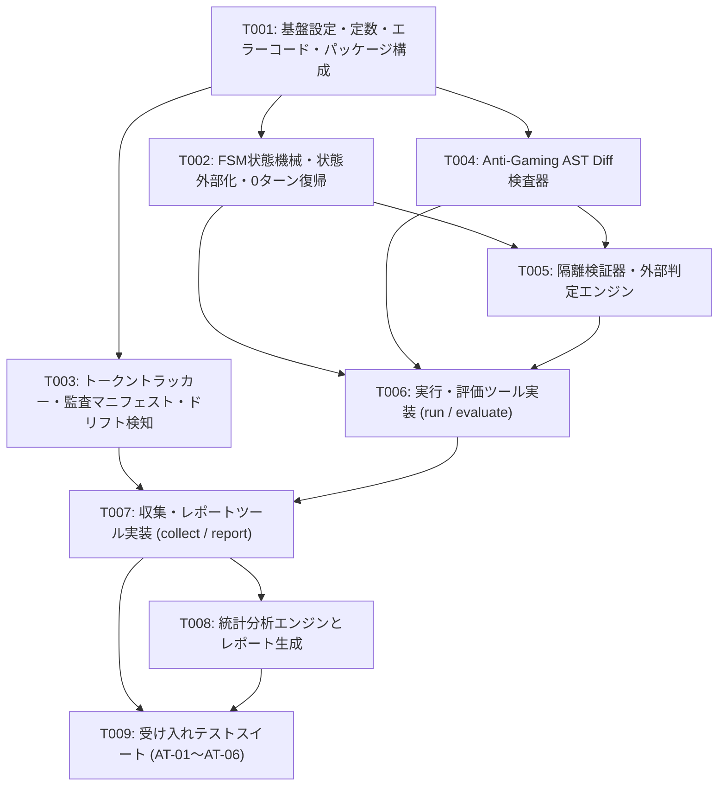

# strict-goal MCP 定量的効果測定基盤 実装計画書（Round 2 改定版）

**パッケージ名**: `strict-goal-benchmark`
**上流設計書**: `docs/design-quantitative-evaluation.md` (`sha256:134b925c12d38ad3cb9570c551508a56064bcc0d7d9ea6bd7d162d0590fe1f25`)
**対象バージョン**: 1.0.0

---

## 1. 概要・目的 (Summary)

本計画は、`strict-goal` MCP（rubric-loop-mcp）の定量的有効性・信頼性・費用対効果を測定するための評価基盤（`strict-goal-benchmark`）の実装計画である（Round 2 改定版）。
Vanilla ReAct（A群）、Prompt-only Rubric（B群）、Default /goal Command（C群）、strict-goal Standard（D群）、strict-goal + 使い捨てサブエージェント協調（E群）の5群比較実験を行い、Held-out Test Suite（隔離隠蔽テスト）、AST Diff改ざん検知、トークントラッカー、FSM状態制御、および自動統計レポート生成基盤を構築する。

Round 1 の敵対的評価指摘に基づき、T006の粒度肥大化（4ツールのスキーマ・ハンドラ一括）を解消し、実験実行系（T006）と集計・レポート系（T007）の2タスクに分割した。これにより全タスクの `estimate_rounds` を1周、変更ファイル数を概ね3以下に適正化した。

上流設計書 `docs/design-quantitative-evaluation.md` の全節について、以下の通り対応方針を確定した：
- **§0（用語定義）**: 概念定義および前提共有のため、独立コード生成は不要（実装不要）。
- **§1（前提条件と設計スコープ）**: 実験前提およびスコープ規定のため、設定値定義以外の実装コード生成は不要（実装不要）。
- **§14（セルフホスティング検証）**: 設計書作成時のプロセス追跡記録であるため、実装基盤コードは不要（実装不要）。
- **§15（却下した代替案とその理由）**: アーキテクチャ判断の根拠記録であるため、実装不要（実装不要）。
- **§2〜§13（全実装要件）**: 失敗モード12件（FM-01〜FM-12）、5群実験・KPI設計、FSMとツールマトリクス、状態外部化と0ターン完全復帰、4ツールの実物Draft-07スキーマ、判定所有権と収束条件、Anti-Gaming機構、Agent Plugins 1.0.0マニフェスト、責務分割とホスト可搬性、監査マニフェスト完全スキーマ、受け入れテストAT-01〜AT-06、決定済み既定値10項目を全9タスク（T001〜T009）で完全に網羅する。

---

## 2. 前提条件と運用制約 (Assumptions)

1. 実行環境は Node.js >= 20 ESM 環境であり、Windows および POSIX 環境でのクロスプラットフォーム動作を保証する。
2. Agent Plugins 1.0.0 仕様に厳密準拠し、既存の strict-goal MCP サーバーとシームレスに連携する。
3. 外部評価器（Evaluator）は被験エージェントのコンテキストおよびファイルアクセスから完全に隔離されたサブプロセスで実行される。
4. 各タスクの中断時は git checkout -- <target_files> および未追跡ファイル個別退避による単一タスク単位のクリーンリセットが可能である。
5. 上流設計書の各節除外判断: §0は用語定義のため実装不要、§1は実験前提のため実装不要、§14は設計作成プロセス追跡のため実装不要、§15は却下代替案理由のため実装不要とし、§2〜§13の全実装決定をタスク群で網羅する。

---

## 3. タスク依存関係グラフ (Task DAG)

- **トポロジカル実行順序**: `T001` → `T002` → `T003` → `T004` → `T005` → `T006` → `T007` → `T008` → `T009`
- **孤立タスク**: 0件
- **循環依存**: なし
- **全タスク粒度**: estimate_rounds ≤ 1, 変更ファイル数 ≤ 3（T009はテスト6ファイル）

---

## 4. タスク詳細仕様 (Task Specifications)

### T001: 基盤設定・定数・エラーコード・パッケージ構成
- **目的**: ベンチマーク基盤の基本パッケージマニフェスト、全10項目の決定済み既定値、専用エラーコードカタログ、およびホスト可搬性ユーティリティを定義する。
- **設計書参照**: §9.1, §9.2, §10.2, §13
- **依存先**: なし (`[]`)
- **変更ファイル**: `package.json`, `plugin.json`, `src/config/defaults.js`, `src/errors/codes.js`, `src/utils/path.js`
- **見積もりラウンド**: 1周

### T002: FSM状態機械・状態外部化永続化・0ターン完全復帰
- **目的**: ベンチマークセッションの全8状態FSM、状態×4ツールの呼び出し可否マトリクスガード、ディスクへのアトミック状態永続化、およびCLI 0ターン完全復帰手順を実装する。FM-06解決。
- **設計書参照**: §2, §4.1, §4.2, §5.1, §5.2
- **依存先**: `["T001"]`
- **変更ファイル**: `src/fsm/state_machine.js`, `src/fsm/matrix_guard.js`, `src/store/bench_store.js`, `src/runner/resume.js`
- **見積もりラウンド**: 1周

### T003: トークントラッカー・監査マニフェスト永続化・ドリフト検知
- **目的**: 入出力・キャッシュトークンの精密計測、trial_manifest.jsonの完全スキーマ生成とgzip圧縮永続化、および固定アンカープロンプトによるモデルドリフト検知プロトコルを実装する。FM-03, FM-11, FM-12解決。
- **設計書参照**: §2, §11.1
- **依存先**: `["T001"]`
- **変更ファイル**: `src/tracker/token_tracker.js`, `src/audit/trial_manifest.js`, `src/monitor/drift_monitor.js`
- **見積もりラウンド**: 1周

### T004: Anti-Gaming検査器（AST Diff改ざん検知・モック検知・フォールバック検査）
- **目的**: テストコード改ざん、アサーション削除・緩和、不正なグローバルモック注入、および非対応フレームワーク向けの2段階フォールバック規則を実装する。FM-02解決。
- **設計書参照**: §2, §8
- **依存先**: `["T001"]`
- **変更ファイル**: `src/evaluator/ast_diff.js`, `src/evaluator/mock_detector.js`, `src/evaluator/fallback_checker.js`
- **見積もりラウンド**: 1周

### T005: 隔離検証器・外部判定エンジン
- **目的**: 被験モデルから不可視のHeld-outテストスイート隔離実行、決定論的な合否判定所有権、および周回・時間・トークン・停滞打ち切りガードを実装する。FM-01, FM-07解決。
- **設計書参照**: §2, §7.1, §7.2, §10.1
- **依存先**: `["T002", "T004"]`
- **変更ファイル**: `src/evaluator/held_out_runner.js`, `src/evaluator/verdict_engine.js`, `src/evaluator/convergence_guard.js`
- **見積もりラウンド**: 1周

### T006: 実験実行・評価ツール実装（benchmark_run, benchmark_evaluate）
- **目的**: 5群実験サンドボックス起動を司る benchmark_run と隔離評価器を叩く benchmark_evaluate の2ツールについて、§6の実物Draft-07スキーマ、バリデータ、合流点インターフェース整合性検査、および異常入力境界値ガードを実装する。FM-05, FM-08, FM-10解決。
- **設計書参照**: §2, §3.1, §6.1, §6.2
- **依存先**: `["T002", "T004", "T005"]`
- **変更ファイル**: `schemas/benchmark_tools.json`, `src/tools/benchmark_run.js`, `src/tools/benchmark_evaluate.js`
- **見積もりラウンド**: 1周

### T007: メトリクス収集・レポートツール実装（benchmark_collect, benchmark_report）
- **目的**: TokenTracker集計値を固定する benchmark_collect と統計比較を行う benchmark_report の2ツールについて、§6の実物Draft-07スキーマ、バリデータ、および集計確定ハンドラを実装する。
- **設計書参照**: §6.3, §6.4
- **依存先**: `["T003", "T006"]`
- **変更ファイル**: `src/tools/benchmark_collect.js`, `src/tools/benchmark_report.js`
- **見積もりラウンド**: 1周

### T008: 統計分析エンジンとレポート生成
- **目的**: §3.2のPrimary/Secondary KPIs計算、Welch's t検定・Mann-Whitney U検定・95%ブートストラップ信頼区間、および完全自動マークダウンレポート生成を実装する。FM-04, FM-09解決。
- **設計書参照**: §2, §3.2
- **依存先**: `["T007"]`
- **変更ファイル**: `src/analytics/kpi_calculator.js`, `src/analytics/stats_test.js`, `src/analytics/markdown_reporter.js`
- **見積もりラウンド**: 1周

### T009: エンドツーエンド受け入れテストスイート (Acceptance Test Suite AT-01〜AT-06)
- **目的**: 設計書§12に定義された受け入れシナリオ6本（AT-01〜AT-06）の自動テストスイートを実装し、全ツールの結合整合性と異常系耐性を完全検証する。
- **設計書参照**: §12 (AT-01〜AT-06)
- **依存先**: `["T007", "T008"]`
- **変更ファイル**: `test/at_01_init.test.js` 〜 `test/at_06_report_stats.test.js`
- **見積もりラウンド**: 1周
