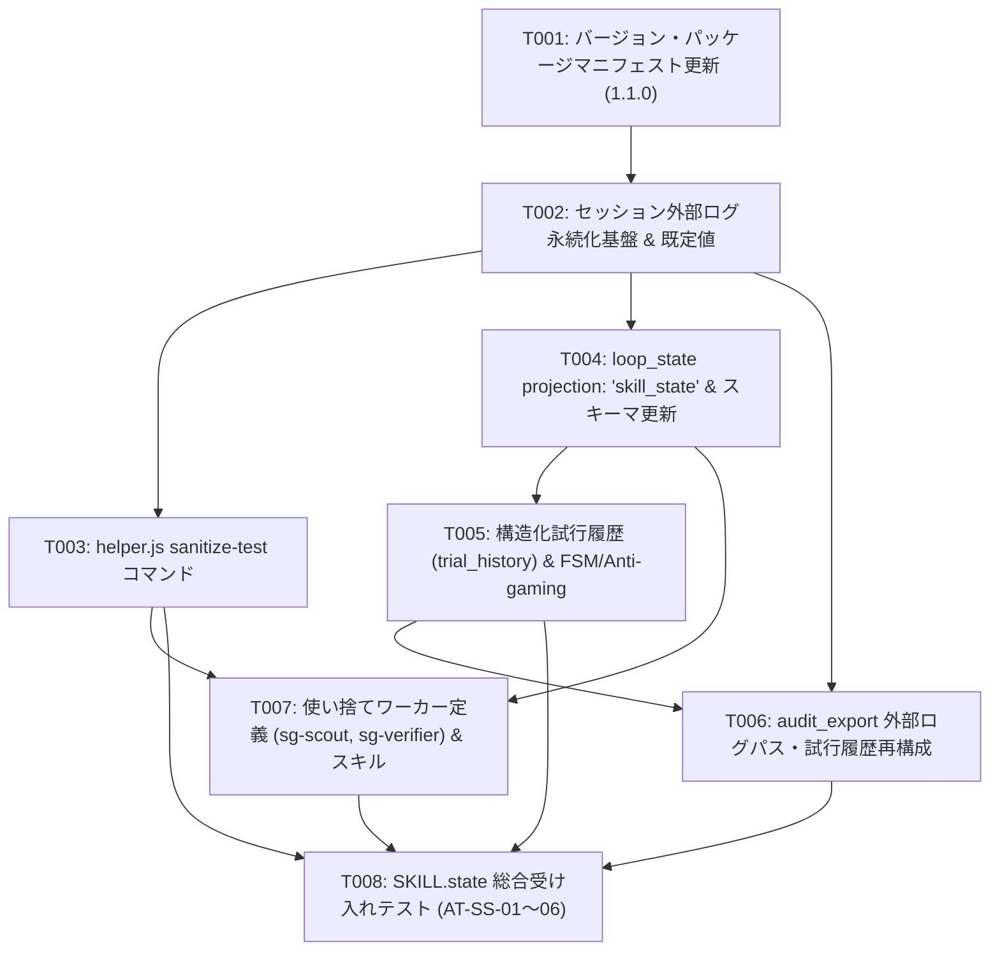

# strict-goal MCP の SKILL.state 化改良 実装計画書

- **上流設計書**: [`docs/design-skill-state-mcp.md`](file:///d:/vagrant/harnesses/rubric-loop-mcp/docs/design-skill-state-mcp.md)
- **上流セッション**: `rl_01M29Q1A29F2DBN1SKDKZNC23Y` (FINAL, chain: `ch_01M29Q1A24DC97FYCN8QGQZ2HC`)
- **上流ダイジェスト**: `sha256:4a53c39c2a5ece748a70e056806e02064a2810f877391f81b462b0c1a6a51751`
- **計画 JSON**: [`docs/plans/plan-skill-state.json`](file:///d:/vagrant/harnesses/rubric-loop-mcp/docs/plans/plan-skill-state.json)

---

## 計画概要 (Summary)

strict-goal MCP サーバーに arXiv:2608.26263 (SKILL.state) に基づくステートレス実行アーキテクチャを導入する実装計画。不確実性の低い中心パッケージ・バージョン定義(T001)およびログ永続化基盤(T002)から開始し、検証困難な外部コマンド出力のサニタイズ(T003)とプロジェクション(T004)を依存の許す限り最前に前倒ししてインターフェースを確定する。その後、FSM・Anti-gaming(T005)、監査ログ再構成(T006)、使い捨てワーカー定義・スキル連携(T007)を整え、総合受け入れテスト(T008)で全6シナリオを網羅する。各タスク完了時点で既存の全471テストが green を維持し、安全に中断・ロールバック可能な構成とする。

---

## 前提条件 (Assumptions)

1. 設計書 §0 (用語定義), §1 (前提条件), §14 (セルフホスティング検証), §15 (却下代替案) は概念定義および検証・意思決定の記録でありコード実装不要であることを明示。その他の全節(§2〜§13)はT001〜T008で完全に網羅される。
2. Node.js >= 20 標準モジュールのみで稼働し、新たな外部 npm 依存関係を追加しない。
3. 既存の 7 ツール構成・MCP インターフェースおよび FSM 状態遷移の後方互換性を完全に維持する。
4. 各タスク完了時点で既存テスト（471件）および新規テストが green を維持し、途中停止時も安全にロールバック可能である。

---

## タスク依存グラフ (Task DAG)

---

## タスク一覧

| ID | タイトル | 依存 | 変更ファイル | 主な受け入れ条件 |
|---|---|---|---|---|
| **T001** | パッケージマニフェストおよびバージョン 1.1.0 定義更新 | なし | `plugin.json` `package.json` `src/version.js` | バージョン 1.1.0 が正しくエクスポートされ、適合性検証スクリプトが exit 0 となること |
| **T002** | セッション外部ログ永続化ディレクトリおよび既定値管理機構の実装 | T001 | `src/config/defaults.js` `src/store/log_store.js` `src/store/session_store.js` | セッション配下に `logs/` が生成され、直近5世代保持ローテーションが動作すること |
| **T003** | `helper.js sanitize-test` サブコマンドの実装 | T002 | `src/implement/sanitize_test.js` `helper.js` | 失敗テストのスタックトレースがサニタイズされ 500 文字以内に要約出力されること |
| **T004** | `loop_state` の `projection: 'skill_state'` 拡張および tools スキーマ更新 | T002 | `schemas/tools.json` `src/skill_state/projector.js` `src/tools/loop_state.js` | 有界三つ組 $(P, \Sigma_t, O_t)$ が 4,000 文字以内で返却され、未指定時は完全後方互換であること |
| **T005** | 構造化試行履歴 (`trial_history`) の管理と FSM / Anti-Gaming 整合性検証 | T004 | `src/store/trial_history.js` `src/fsm/guard.js` `src/judge/score_submit.js` | 試行履歴が外部永続化され、FSMマトリクス違反拒否および厳格な FINAL 判定が行われること |
| **T006** | `audit_export` の外部ログパスおよび試行履歴再構成対応 | T002, T005 | `src/tools/audit_export.js` `test/verify_audit.js` | 各ラウンドの `logs_archive` 相対パスが含まれ、第三者監査スキーマを通ること |
| **T007** | 使い捨てワーカー定義 (`sg-scout`, `sg-verifier`) およびスキル手順文書化 | T003, T004 | `.agents/agents/sg-scout.md` `.agents/agents/sg-verifier.md` `skills/strict-goal/SKILL.md` | エージェント定義が存在し、SKILL.md に 0 ターン完全復帰手順が明記されていること |
| **T008** | SKILL.state 総合受け入れテスト (AT-SS-01 〜 AT-SS-06) の実装と統合 | T003, T005, T006, T007 | `test/at_ss.test.js` | AT-SS-01〜06 の全シナリオが自動テストとして実装され、全件 exit 0 で通過すること |
