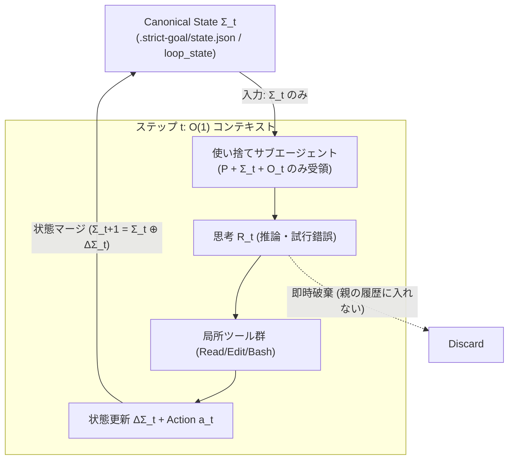

# SKILL.state化 検討メモ

- **対象論文**: [SKILL.state: Scalable Long-Horizon Agent Skills (arXiv:2608.26263)](https://arxiv.org/abs/2608.26263)
- **目的**: 会話履歴の長文化（二次関数的トークン消費・コンテキスト汚染）を回避し、性能を維持・向上させながらトークン消費を大幅削減するアーキテクチャの検討。

---

## 1. SKILL.state の核心思想

従来の LLM エージェント（ReAct / Append-only 会話履歴）は、過去の思考・行動・観測をすべて累積プロンプトとして引き回すため、ステップ数 $t$ に対してプロンプト長が $\mathcal{O}(t)$、累積トークンが $\mathcal{O}(T^2)$ で爆発する。

SKILL.state はこれを排除し、ステップ $t$ のプロンプト入力を厳密に **3要素のみ** に限定する：

$$\text{Prompt}(t) = (P, \Sigma_t, O_t)$$

- **$P$（不変スキル仕様）**: システム指示、利用可能ツール定義、ドメインルール。
- **$\Sigma_t$（構造化実行状態）**: ドメインスキーマに基づく明示的な状態辞書（十分統計量）。
- **$O_t$（直近の観測結果）**: 直前ステップのツール出力や環境フィードバック（過去ログは含まない）。

### 状態遷移サイクル
1. LLM は $(P, \Sigma_t, O_t)$ を受け取り、中間思考 $R_t$（CoT）を経て、状態差分 $\Delta \Sigma_t$ とアクション $a_t$ を出力する。
2. ランタイムが $\Delta \Sigma_t$ を検証し、$\Sigma_{t+1} = \Sigma_t \oplus \Delta \Sigma_t$ としてマージ更新する。
3. **中間思考 $R_t$ および生ログは即時破棄** され、次ステップのプロンプトには一切引き継がれない。
4. **計算量**: プロンプト長 $\mathcal{O}(1)$（有界）、累積トークン消費 $\mathcal{O}(T)$（線形）。

---

## 2. 現行 strict-goal との親和性と課題

### 強み（すでに備わっている基盤）
- `strict-goal` サーバーは既に **FSM（有限状態機械）＋セッションストア** として設計されている。
- `loop_state` により、`session_id`, `round`, `state`, `verdict`, `last_evaluation.must_fix`, `current_artifact.digest` など、実行状態 $\Sigma$ に相当する構造化データが常に抽出可能。
- `sg-implementer`（子）→ `sg-worker`（孫）による使い捨てワーカー（Ephemeral Worker）の概念が先行導入されている。

### 課題（長文化のボトルネック）
- **観測・思考の会話履歴への沈殿**:
  ファイル全文の読み出し、長大なテスト実行ログ、Git diff、中間の試行錯誤が会話履歴に追記され続ける。
- **二重持ち**:
  サーバー側に確定的な状態があるにもかかわらず、LLM 側が過去の会話ログを頼りに前ターンの文脈を再構成している。

---

## 3. サブエージェント化の粒度設計（Tool単位 vs トランザクション単位）

「Tool使用単位でのサブエージェント化」を検討する際、分割粒度によってトークン効率が逆転する。

| 分割粒度 | トークン効率 | 性能・文脈維持 | 判定 |
|---|---|---|---|
| **微小ツール単位** (1 grep, 1 edit ごと) | **悪化** (起動プロンプト・初期メタデータが都度課金) | 大幅低下 (文脈喪失による手戻り、超高レイテンシ) | **非推奨** |
| **状態更新トランザクション単位** (探索 / 局所実装 / 検証) | **劇的改善** (生ログを子コンテキスト内で消費・破棄) | 向上 (局所タスクへの高集中、親の汚染ゼロ) | **推奨（最適解）** |
| **全工程一括** (従来の単一エージェント) | **悪化** (全ログが永続蓄積、$\mathcal{O}(T^2)$ 爆発) | 劣化 (長大ターンで注意散漫・コンテキスト上限圧迫) | **現行の課題** |

**結論**: 1回のツール呼び出しごとではなく、**「観測を取得して状態更新 $\Delta \Sigma$ を確定するまでのアトミックな作業単位」** で使い捨てサブエージェント化するのが最もトークン効率が高い。

---

## 4. SKILL.state 化の具体アーキテクチャ方針

### 4-1. 3つの使い捨てワーカー（Ephemeral Workers）
1. **`sg-scout`（探索・調査）**:
   - `bm25-code-search`, `read_file`, `grep` を実行。
   - 生のファイル内容を親には戻さず、「対象ファイル・関数シグネチャ・変更箇所」の要約事実（$\Delta \Sigma$）のみを返却。
2. **`sg-worker`（局所実装・単体テスト）**:
   - 単一タスク／`must_fix` 1件のコード変更と単体テスト通過に専念。
   - 「変更ファイル一覧、テスト結果サマリ」のみを返却。
3. **`sg-verifier`（検証・コミット）**:
   - `helper.js test-run` / `fileset` の実行、`artifact_commit` / `score_submit`。
   - 「確定 digest、サーバー verdict、次ステップ指示」のみを返却。

### 4-2. `loop_state` を Canonical Execution State $\Sigma$ へ昇格
- スレッドの会話履歴を頼りにせず、常に `loop_state` の JSON を現在地として参照する。
- 途中でコンテキストが溢れたりリセットされても、`loop_state(session_id)` 1発で完全に同一状態から再開可能にする。

### 4-3. 観測データ $O_t$ のプロジェクション（要約・サニタイズ）
- テスト失敗時の数十〜数百行のスタックトレースをそのままコンテキストに注入せず、`helper.js` 等で「失敗アサーション行・エラーメッセージ」のみを抽出して渡す。

---

## 5. 消費トークンの理論削減量（概算）

### 計算式
- **従来型（会話履歴累積）**:
  $$\mathcal{K}_{\text{conv}}(T) = T \cdot P + \frac{T(T-1)}{2} \Delta + T \cdot R \quad [\mathcal{O}(T^2)]$$
- **SKILL.state（ステートレス状態遷移）**:
  $$\mathcal{K}_{\text{state}}(T) = T \cdot (P + |\Sigma| + |O| + R) \quad [\mathcal{O}(T)]$$

### 前提パラメータ（strict-goal 実装ループ想定）
- $P = 3,000$ tokens（指示・MCPツール定義）
- $\Delta = 2,500$ tokens（1ターンの履歴増加量: ファイル差分・テストログ・思考）
- $|\Sigma| = 500$ tokens（構造化状態 JSON）
- $|O| = 1,000$ tokens（サニタイズされた直近観測）
- $R = 800$ tokens（出力思考＋アクション）

### ターン数別の理論試算

| 実行規模（ターン数 $T$） | 従来型（会話累積） | SKILL.state（理論値） | **削減率 / 圧縮比** |
|---|---|---|---|
| **小規模（$T = 10$）** 単一機能・1〜2タスク | 約 **150,000** tokens | 約 **53,000** tokens | **約 65% 削減**（2.8倍高効率） |
| **中規模（$T = 25$）** 4〜5タスク＋採点周回 | 約 **845,000** tokens | 約 **132,500** tokens | **約 84% 削減**（6.4倍高効率） |
| **大規模（$T = 50$）** 複合機能・must_fix 複数回 | 約 **3,265,000** tokens | 約 **265,000** tokens | **約 92% 削減**（12.3倍高効率） |

※親エージェント＋使い捨てサブエージェントの現実的ハイブリッド構成でも、**70% 〜 85% の削減** が見込める。

### 論文（arXiv:2608.26263）の実測値
- $T = 100$（Warehouse）: 従来型 1,062,387 tokens → SKILL.state 65,408 tokens（**93.8% 削減 / 16.2倍高効率**）
- $T = 200$（Warehouse）: 従来型 6,100,000 tokens → SKILL.state 122,000 tokens（**98.0% 削減 / 50倍高効率**）

---

## 6. 性能の向上・低下具合（トレードオフ分析）

### 性能が【向上】する点
1. **堂々巡りの根絶 (Pass@1 向上)**:
   探索済みファイルや失敗した仮説が $\Sigma$ に構造化記録されるため、同じ失敗コマンドを繰り返さない（InterCode CTF で成功率 **41.8% → 54.2%** へ向上）。
2. **ノイズ耐性 (テレメトリ・大量ログ耐性)**:
   数千行のビルドログや無関係な差分が親プロンプトに入らないため、指示の見落としや脱線が起きない（ノイズ下成功率: **0.53 → 0.97**）。
3. **状態復帰の迅速化 (State Recovery)**:
   古い事実に基づく「幻覚」に引きずられず、差し戻し（`must_fix` や `kickback`）時に **0ターン** で最新方針に追従。
4. **長大タスクの破綻防止**:
   $T > 50$ を超えてもコンテキスト長制限（200k 等）に達せず、終盤まで初速と精度を維持。

### 性能が【低下・悪化】しうるリスクと対策
1. **後から重要になる観測の欠落（Information Loss）**:
   - リスク: 調査時に「無関係」と判断して捨てたエラーログに、数周後に必要となる手がかりがあった場合、思い出せない。
   - **対策**: 会話ログに頼るのではなく、`.strict-goal/logs/` などの物理ファイルにログを永続化し、必要な時だけ参照する。
2. **状態更新（$\Delta \Sigma$）の誤上書き**:
   - リスク: LLM が JSON 差分を更新する際にキーを脱落させる。
   - **対策**: 状態更新を LLM の自由出力に委ねず、`strict-goal` サーバーの決定的検証・マージロジックで担保する。
3. **局所化による意図の乖離（Context Disconnect）**:
   - リスク: サブワーカーの入力を削りすぎると、全体の設計意図や型定義に反した実装をしてしまう。
   - **対策**: 不変のスキル仕様 $P$ として「対象タスクの受け入れ基準」「対象インターフェース型定義」を過不足なく注入する。
