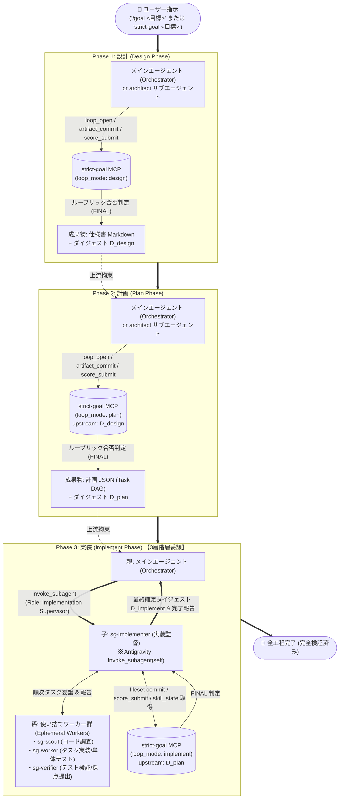
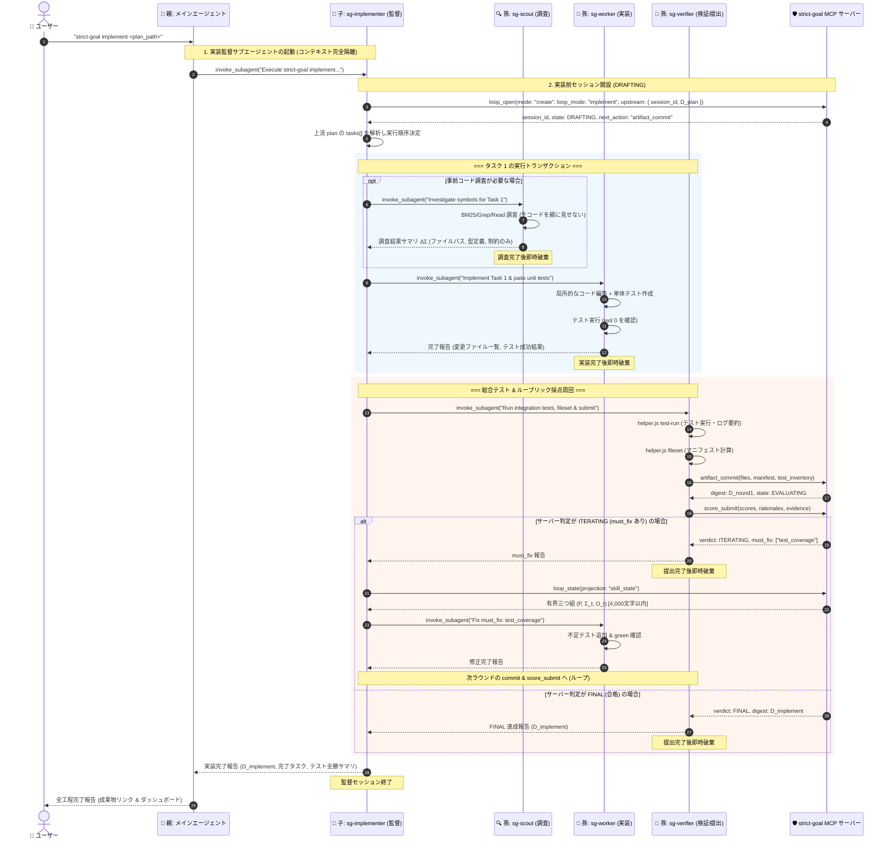
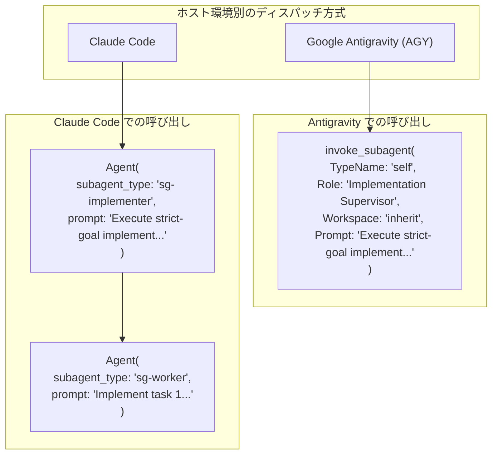
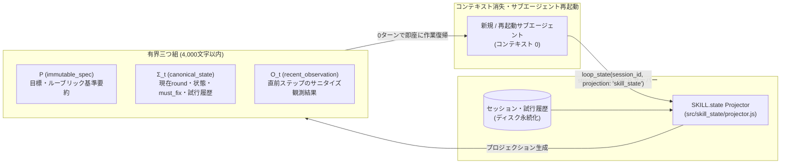

# 設計から実装までのサブエージェント呼び出しフロー (strict-goal-agy)

本ドキュメントは、`strict-goal-agy`（SKILL.state ステートレス実行基盤対応版 strict-goal）において、要件定義・設計（design）から計画（plan）、実装（implement）に至る全ライフサイクルで**サブエージェントがどのように階層的に呼び出され、責務分担されるか**を図示・解説したものです。

---

## 1. 全体ライフサイクル概要 (End-to-End Pipeline)

strict-goal は、サーバー主導のルーブリック評価によって各フェーズの完了（`FINAL` 判定）を厳格に保証します。
親エージェント（Orchestrator）のコンテキスト枯渇・テストログ汚染を防ぐため、**設計・計画は親または特化型エージェント、実装フェーズは 3 層階層型サブエージェント（親 → 子監督 → 孫ワーカー）** に委譲します。

---

## 2. 実装フェーズ（Phase 3）の詳細シーケンス図

実装フェーズでは、コード編集や大量のテストログで親のコンテキストが圧迫されるのを防ぐため、**「子監督（`sg-implementer`）」がループ進行と FSM セッションを統括**し、**個別の作業トランザクションを「孫（使い捨てワーカー）」に委譲**します。

---

## 3. エージェント階層と責務分担マトリクス

`strict-goal-agy` では、各エージェントのライフサイクルとツール権限を厳密に制限することで、**責任の局所化**と**コンテキストの最小化**を実現しています。

| 階層 | エージェント名 | ライフサイクル | ツール権限 | 主な責務・役割 |
|---|---|---|---|---|
| **第 1 層 (親)** | **Orchestrator** (メインエージェント) | セッション全体常駐 | 全ツール (`Agent`, MCP, Bash, Read, Write 等) | ・ユーザー対話・ゴール受領 ・`design` → `plan` の策定と採点完遂 ・子エージェント (`sg-implementer`) の起動と最終受領 |
| **第 2 層 (子)** | **`sg-implementer`** (実装監督) | 実装フェーズ常駐 | `invoke_subagent`, `Agent`, Bash, Read, Write, strict-goal MCP | ・`loop_open` による DRAFTING セッション開設 ・上流 `plan` のタスク依存解析 (`tasks[]`) ・各タスクの孫ワーカーへの順次ディスパッチ ・サーバーの `must_fix` 解消管理と反復判定制御 |
| **第 3 層 (孫)** | **`sg-scout`** (コード探索・調査) | **使い捨て (Ephemeral)** (調査完了で即破棄) | BM25 `search`, Read, Grep, Glob, Bash | ・対象ファイルやシンボル、依存関係の特定 ・数千行の生コードを読んでも親には **要約事実 ($\Delta \Sigma$) のみ** を返却 |
| **第 3 層 (孫)** | **`sg-worker`** (単一タスク実装) | **使い捨て (Ephemeral)** (タスク完了で即破棄) | Read, Write, Edit, Grep, Glob, Bash, BM25 `search` *(strict-goal MCP 禁止)* | ・指示された 1 タスク / 1 `must_fix` の実装 ・単体テスト作成とローカル pass (exit 0) の確認 ・ハーネスや git commit の操作は行わない |
| **第 3 層 (孫)** | **`sg-verifier`** (検証・採点提出) | **使い捨て (Ephemeral)** (採点完了で即破棄) | Bash, Read, `artifact_commit`, `score_submit`, `loop_state` *(コード編集禁止)* | ・`helper.js test-run` によるテスト実行とログサニタイズ ・`helper.js fileset` によるマニフェスト計算 ・成果物提出・採点送信とサーバー合否判定の親への伝達 |

---

## 4. ホスト環境ごとのサブエージェント呼び出し差異の吸収

`strict-goal-agy` は、ホスト環境（Antigravity / Claude Code）のサブエージェント API 差異をスキル層 (`SKILL.md`) で吸収します。

1. **Google Antigravity**:
   - `invoke_subagent` ツールを使用。
   - `TypeName: "self"` かつ `Role: "Implementation Supervisor"`, `Workspace: "inherit"` を指定して起動。
2. **Claude Code**:
   - `.agents/agents/` または `.claude/agents/` 配下のサブエージェント定義を参照。
   - `Agent(subagent_type="sg-implementer", prompt=...)` で子監督を起動し、監督内から `Agent(subagent_type="sg-worker", ...)` で孫ワーカーを順次起動。

---

## 5. SKILL.state によるステートレス復帰アーキテクチャ

サブエージェントが途中で異常終了した場合やコンテキストが溢れた場合でも、`strict-goal-agy` ではセッションを安全に再開できます。

- **有界射影 ($P, \Sigma_t, O_t$)**:
  - `loop_state` に `projection: "skill_state"` を指定することで、過去の巨大な対話履歴を読み込まずとも、4,000 文字以内の最小限の要約データだけで作業を再開可能。
- **生ログの外部永続化**:
  - 詳細なテスト出力やエラーログは `.strict-goal/sessions/<session_id>/logs/` に外部退避され、親・子エージェントには要約（`helper.js sanitize-test` 経由）のみが渡されます。
